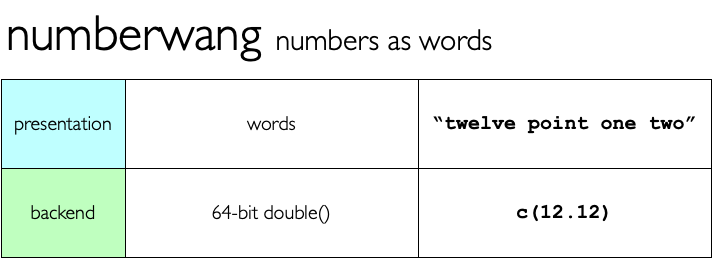

<!-- README.md is generated from README.Rmd. Please edit that file -->

# typhoid - non-standard numeric datatypes

<!-- badges: start -->


<!-- badges: end -->

`typhoid` provides implementations of some non-standard datatypes using
`{vctrs}`


## What’s in the box

-   `numberwang(x)` for creating numeric values which present themselves
    as words.
-   `uint16(x)` for creating 16-bit unsigned integers, where each value
    is stored as a pair of raw bytes.
-   `fixedpt(x, decimals = 3)` for creating 32-bit fixed point numeric
    values.

Each of the types supports `as_<type>()` and `is_<type>()`, as well as
standard arithmetic operations (`+`, `*` etc) and mathematical functions
e.g. `abs()`

## Limitations

These types were created in order to explore the [`{vctrs}`
package](https://vctrs.r-lib.org/index.html), and its capabilities for
easily creating new types, with minimal effort, along with broad support
for standard R features.

These are all pretty naive implementations with ill-defined overflow,
and incomplete implementations.

They *could* be the core of properly useful, robust datatypes - but for
now they merely stand as small tutorials on how new types can be defined
with the `{vctrs}` package.

## Installation

You can install from [GitHub](https://github.com/coolbutuseless/typhoid)
with:

``` r
# install.package('remotes')
remotes::install_github('coolbutuseless/numberwang')
remotes::install_github('coolbutuseless/typhoid')
```



The **numberwang** type is backed by the
[`{numberwang}`](https://github.com/coolbutuseless/numberwang) package
which provides functions for converting from numbers to words, and vice
versa.

``` r
num <- numberwang(42.123)
num
```

      <typ_numberwang[1]>
      [1] "forty-two point one two three"

``` r
num + 5
```

      <typ_numberwang[1]>
      [1] "forty-seven point one two three"

``` r
numberwang(1:3) * 10
```

      <typ_numberwang[3]>
      [1] "ten"    "twenty" "thirty"

``` r
numberwang(1:3) * as_numberwang("twenty seven")
```

      <typ_numberwang[3]>
      [1] "twenty-seven" "fifty-four"   "eighty-one"


`uint16` values are represented internally as a pair of bytes.

Since a `uint16` takes up only 16bits, it can only hold integers in the
range 0-65535.

This offers space savings compared with R’s standard integer (four
bytes), as long as your numbers fit in the given range.

Arithmetic operations are performed modulo 65536.

``` r
#~~~~~~~~~~~~~~~~~~~~~~~~~~~~~~~~~~~~~~~~~~~~~~~~~~~~~~~~~~~~~~~~~~~~~~~~~~~~~
# uint16 doesn't really behave differently from a small integer
#~~~~~~~~~~~~~~~~~~~~~~~~~~~~~~~~~~~~~~~~~~~~~~~~~~~~~~~~~~~~~~~~~~~~~~~~~~~~~
uint16(42)
```

    #> <typ_uint16[1]>
    #> [1] 42

``` r
uint16(c(100, 150)) * 2
```

    #> <typ_uint16[2]>
    #> [1] 200 300

``` r
#~~~~~~~~~~~~~~~~~~~~~~~~~~~~~~~~~~~~~~~~~~~~~~~~~~~~~~~~~~~~~~~~~~~~~~~~~~~~~
# uint16 uses only half the memory of a regular integer, but has
# a much reduced range as well
#~~~~~~~~~~~~~~~~~~~~~~~~~~~~~~~~~~~~~~~~~~~~~~~~~~~~~~~~~~~~~~~~~~~~~~~~~~~~~
ints <- sample(65535)
lobstr::obj_size(ints)
```

    #> 262,192 B

``` r
lobstr::obj_size(uint16(ints))
```

    #> 131,904 B


Fixed point numbers are implemented as integer values and a divisor
which is a power of 10. For instance `12.34` is represented as the
integer `1234` with a divisor of 100.

Fixed point numbers show as many decimal places as set during
initialisation with the `fixedpt(x, decimals = 3)` call.

When numeric operations are performed on a `fixedpt`, the result is also
a fixed point, with the number of decimals set to the be the maximum of
decimal places of the two arguments.

Numbers are only representable as a `fixedpt` if the unscaled number
fits into a normal R integer.

``` r
n1 <- fixedpt(1:5, decimals = 3)
n1
```

    #> <typ_fixedpt[5]>
    #> [1] 1.000 2.000 3.000 4.000 5.000

``` r
n2 <- fixedpt(101:105, decimals = 5)
n2
```

    #> <typ_fixedpt[5]>
    #> [1] 101.00000 102.00000 103.00000 104.00000 105.00000

``` r
n1 * n2
```

    #> <typ_fixedpt[5]>
    #> [1] 101.00000 204.00000 309.00000 416.00000 525.00000

## Acknowledgements

-   R Core for developing and maintaining the language.
-   CRAN maintainers, for patiently shepherding packages onto CRAN and
    maintaining the repository
